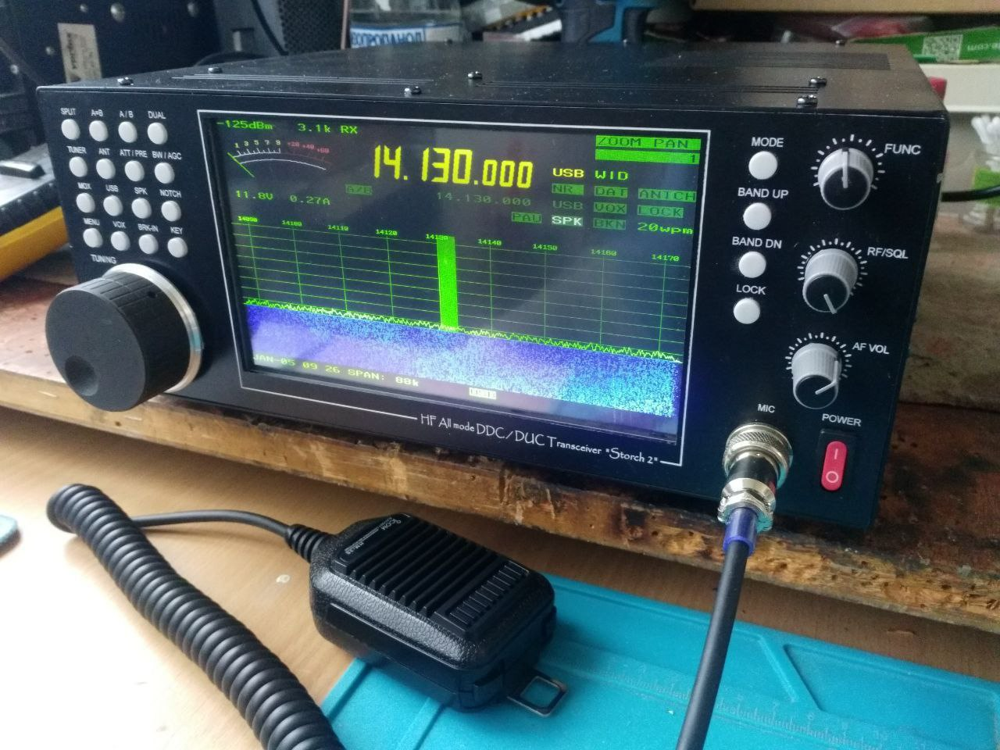

# Трансивер КВ диапазона «Storch» (Аист)

*Фотография R6KB*

## Основные характеристики

- **Технология**: SDR DDC (прямая оцифровка ВЧ сигнала)
- **Диапазон частот**:
    - Приём: **30 кГц – 54 МГц**
    - Передача: **500 кГц – 54 МГц**
- **Мощность передатчика**:
    - 500 кГц – 1 МГц: **≥10 Вт**
    - 1 МГц – 40 МГц: **≥100 Вт** (до 200 Вт с согласованной антенной)
    - 40 МГц – 54 МГц: **≥20–35 Вт**
- **Чувствительность приёмника**: **≤0.2 мкВ** (SSB, полоса 3.1 кГц).
- **Одновременный приём** на разных частотах в пределах поддиапазона.
- **АЦП**: 16 бит, **122.88 МГц**.
- **Динамический диапазон (BDR)**: **≥125 дБ**.
- **Аудио**: 24-битные стерео ЦАП/АЦП.
- **Интерфейсы**:
    - **Ethernet** (удалённое управление и мониторинг).
    - **USB** (управление, передача аудио, запись на флеш-накопитель).
    - **IQ-выход** для внешней обработки.
- **Антенны**:
    - Встроенный коммутатор на **3 антенны** (2 TX/RX + 1 RX).
    - Автоматический тюнер (ATU) с памятью настроек (**≤2.5 с** для новой антенны).
- **Защита**: от перегрева, КЗ антенны, статики, переполюсовки питания.
- **Охлаждение**: Адаптивная система с низким уровнем шума.
- **Габариты**: 330 × 107 × 252 мм (Ш×В×Г).
- **Вес**: **3.15 кг**.
- **Питание**: **10–15 В DC** (до **25 А** на передаче).

### Дополнительные возможности
- Поддержка **трансвертера VHF (144–146 МГц)**.
- **USB-запись** аудио каналов.
- **Сетевые функции**: удалённое управление и мониторинг (опционально).

## Полезные ссылки
- [BOM](doc/BOM/)
- [Схемы](doc/schematic/)
- [Gerber-файлы](doc/gerber/)
- [Монтажная документация](doc/assembly/)
- [Настройка окружения и компиляция программной части](doc/software/)

## Контакты
**Автор**: Геннадий Завидовский  
**Email**: [mgs2001@mail.ru](mailto:mgs2001@mail.ru)  
**Телеграм**:
- Чат: [https://t.me/Sokol_SDR_DDC](https://t.me/Sokol_SDR_DDC)
- Канал: [https://t.me/sokol_ddc](https://t.me/sokol_ddc)

---  
*Проект открыт для доработок и ремонта*  