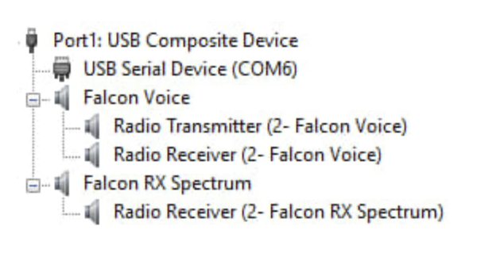

# Техническое описание проекта HTRX

---

## Аппаратные особенности

### FPGA
- Загрузка процессором при каждом запуске (менее 0.1 сек).
- Прошивка синхронизирована с основной программой.
- Контроль подключения:
    - Правый светодиод загорается при успешной загрузке FPGA.
    - Светодиоды «Передача» и «Прием» отражают статус работы.
    - Свечение светодиодов в «полнакала» указывает на отсутствие контакта дна FPGA с землей.

---

### TFT-панель
- Подключение через параллельный RGB или LVDS интерфейс напрямую к процессору.
- Видеобуфер формируется в памяти целиком.
- Реализовано двойное буферирование:
    - Формирование изображения в неотображаемом буфере.
    - Переключение буферов по сигналу вертикальной синхронизации.

---

### USB

- Режим **High-Speed (HS)** с пропускной способностью **480 Мбит/с**.
- Поддержка **USB UAC2** для передачи:
    - Панорамы: 32 бит / 96 кГц (стерео).
    - Звука: 24 бит / 48 кГц (стерео).
- Повышение разрядности АЦП позволяет минимизировать использование АРУ в цифровых режимах.
- На плате установлен **USB HUB** с возможностью вывода портов на переднюю/заднюю панели.
- Поддерживаемые устройства: накопители, клавиатуры.

---

### Процессор
- **Allwinner T113-s3**:
    - 2 ядра **Cortex-A7** (1.2 ГГц).
    - Корпус: 128 выводов (шаг 0.4 мм).
- Встроенная память: **128 МБ DDR3**.
- Реализация алгоритмов без оптимизации под ограниченные ресурсы.

---

### Обработка сигналов
- Используются **FIR-фильтры** (минимальные фазовые искажения).
- Линия задержки для телеграфного ключа:
    - Такт: **1 мс** или **5 мс** (зависит от конфигурации).
    - Задержка перехода на передачу: **15–50 мс** (предотвращение искажений при break-in).
- Формирование огибающей сигнала в обход фильтров приема.

---

## Звуковая подсистема
- Реализована запись звука (**bare metal**, без использования Linux).
- Кодек:
    - Тактовая частота от FPGA: **MCLK = 12.288 МГц**.
    - Режим **MASTER** на шине I2S.
    - Выходные сигналы:
        - **BCLK**: 3075 кГц.
        - **LRCLK**: 48 кГц.
    - Напряжения:
        - Динамик: ~2.4 В.
        - Наушники (до конденсаторов): ~1.6 В.

---

## Запуск и диагностика
- Контроль частот:
    - Тестеры с частотомером (до 10 МГц) для проверки BCLK/LRCLК.
    - Режим измерения постоянного тока: значения 1.6–1.8 В.
- Сигналы SPI: появление напряжения на выходах кодеков при отправке команд.

---

## Ссылки
- Репозиторий проекта: [https://github.com/ua1arn/hftrx](https://github.com/ua1arn/hftrx) (ветка `develop`).